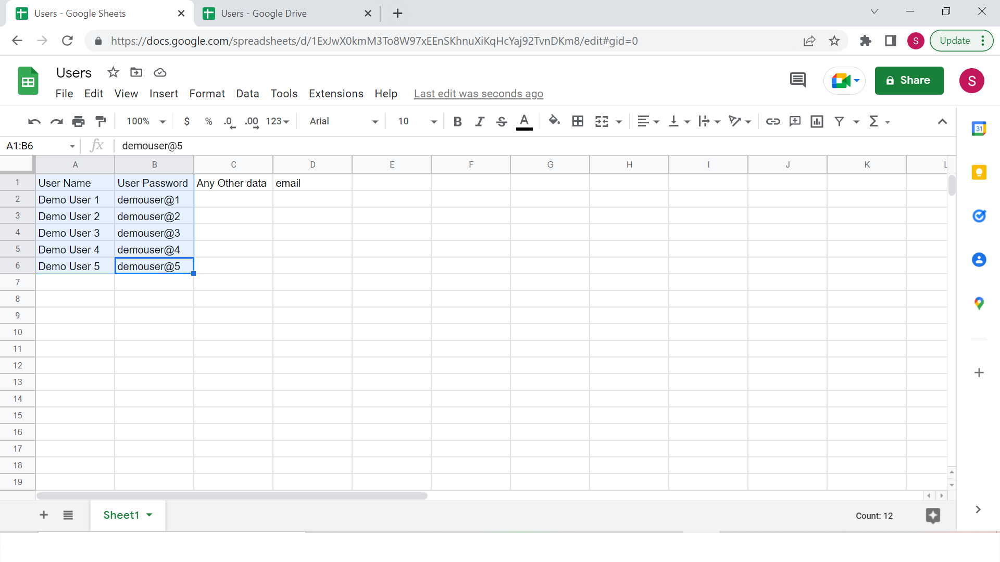
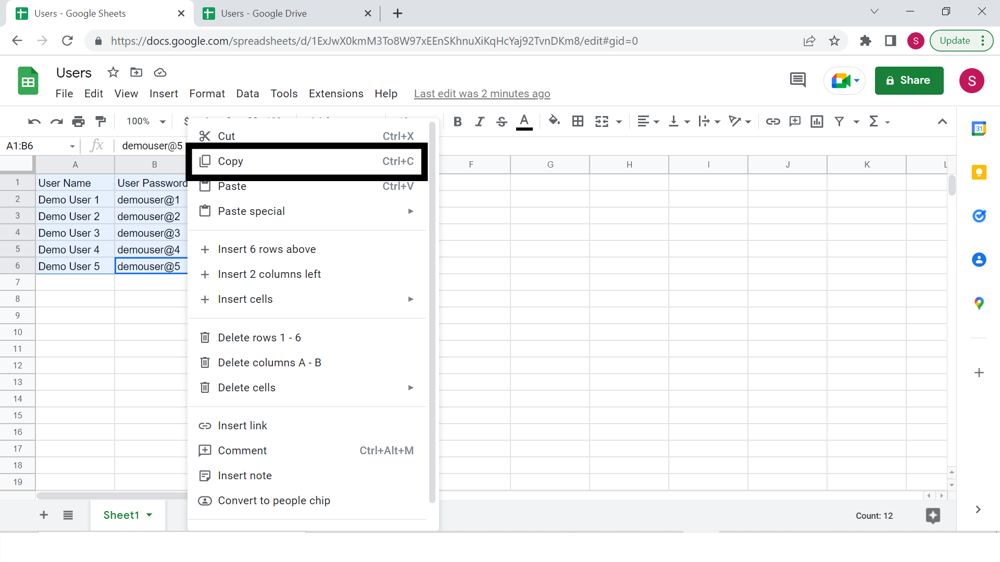

# Import Users From Table

In order to import users from table , follow the steps given below

* &#x20;Open Google Sheet
* Make 2 Columns 'User Name' & 'User Password'. The User Name column should be the 'A' column & Password should be column 'B'

* Fill the rows with User name and custom passwords . if you want random password, fill this text '%random%'

* Select the data you want to import

* Right click on the selected area and click on 'Copy' or click Ctrl C

* Click On 'Import Users From Table Option'
* Then, Paste it on your HectTrak Assessmento Create Dashboard

